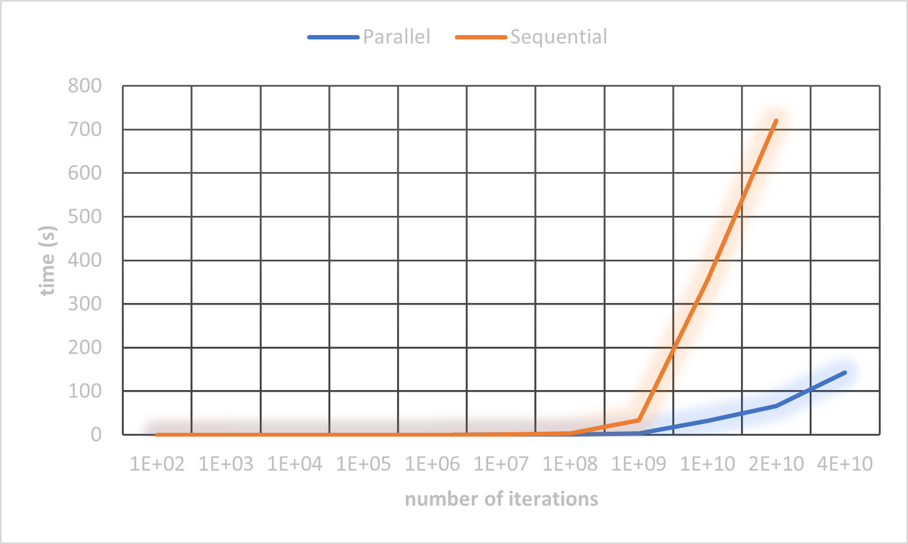

# Parallel processing

### Parallelization of pi calculation using monte carlo method
 
Time taken (in seconds):

| n           | Parallel (in seconds)  | Sequential (in seconds)   | speedup     |
|:-----------:|:----------:|:-------------:|:-----------:|
| 1E+02       | 0.006485   | 0.000011      | 0.001696222 |
| 1E+03       | 0.00686    | 0.000025      | 0.003644315 |
| 1E+04       | 0.011504   | 0.000475      | 0.041289986 |
| 1E+05       | 0.030729   | 0.005378      | 0.175013831 |
| 1E+06       | 0.037136   | 0.032632      | 0.878716071 |
| 1E+07       | 0.134041   | 0.369758      | 2.758544028 |
| 1E+08       | 0.815843   | 3.474256      | 4.258486008 |
| 1E+09       | 3.758002   | 33.502761     | 8.91504608  |
| 1E+10       | 32.47614   | 354.777593    | 10.92425371 |
| 2E+10       | 66.456172  | 720.602836    | 10.84327933 |
| 4E+10       | 142.071659 | Too much time | ???         |